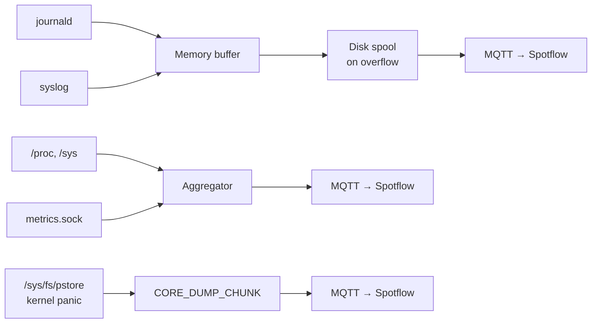

# spotflowd

Linux observability daemon for the [Spotflow](https://spotflow.io) platform.

Collects **logs** (journald, syslog), **OS metrics** (CPU, memory, disk, network), and **kernel crash dumps** (pstore), buffers them locally, and streams them to Spotflow over a persistent MQTT/TLS connection. Local applications can also publish **custom metrics** via a Unix domain socket.

## How it works



- **Memory-first buffer** — log entries are held in RAM (configurable size) to minimise flash writes on embedded targets.
- **Disk spool** — when memory is full, entries are flushed to disk in CBOR chunks. Oldest chunks are dropped when the spool size limit is reached.
- **Publish order** — when connectivity is restored, the newest data is sent first (memory), then older backlog (disk, newest chunk first).
- **Metrics aggregation** — OS and custom samples are collected on a configurable interval and accumulated (sum / count / min / max) before uploading. Aggregation windows: `none`, `1m`, `1h`, `1d`.
- **Custom metrics socket** — any local process can publish application-level metrics via a Unix socket using newline-delimited JSON. No SDK dependency required.
- **Persistent MQTT connection** — single TLS connection to `mqtt.spotflow.io:8883`; reconnects automatically on failure.
- **Best-effort delivery (QoS 0)** — logs, metrics, and crash dumps use MQTT without broker acknowledgements. Publish success means acceptance into the local MQTT queue. Records already handed to MQTT may be lost during a disconnect, crash, or shutdown.
- **Boot log replay** — collects up to 1,000 existing current-boot records per log source on startup, then follows new logs. Collection starts independently of network connectivity.

## Installation

### Quick install (recommended)

Install the latest pre-built binary with a single command:

```bash
curl -sSfL https://github.com/spotflow-io/spotflowd/releases/latest/download/install.sh | sudo bash
```

This detects your architecture, downloads the correct binary, creates the `spotflow` system user, installs the systemd service, and drops a starter config at `/etc/spotflow/spotflowd.toml`.

| Flag | Description |
|------|-------------|
| `--syslog-only` | Install the minimal build without journald support |
| `--version 0.1.0` | Install a specific version instead of latest |

Example — install the syslog-only variant:

```bash
curl -sSfL .../install.sh | sudo bash -s -- --syslog-only
```

After installing, edit `/etc/spotflow/spotflowd.toml` and set `device.id` and `device.ingest_key` from your Spotflow dashboard, then start the service:

```bash
sudo systemctl start spotflowd
sudo spotflowd status
sudo journalctl -u spotflowd -f
```

---

### Download pre-built binaries

Pre-built binaries are available on the [GitHub Releases](https://github.com/spotflow-io/spotflowd/releases) page.

| Architecture | Target triple | Default (journald + syslog) | Syslog-only |
|---|---|---|---|
| x86-64 | `x86_64-unknown-linux-gnu` | `spotflowd-*-x86_64-unknown-linux-gnu.tar.gz` | `...-syslog-only.tar.gz` |
| ARM64 | `aarch64-unknown-linux-gnu` | `spotflowd-*-aarch64-unknown-linux-gnu.tar.gz` | `...-syslog-only.tar.gz` |
| ARMv7 | `armv7-unknown-linux-gnueabihf` | `spotflowd-*-armv7-unknown-linux-gnueabihf.tar.gz` | `...-syslog-only.tar.gz` |

Each tarball contains the `spotflowd` binary, `spotflowd.toml.example`, and `spotflowd.service`.

---

### Build from source

<details>
<summary>Click to expand</summary>

**1. Install system dependencies**

```bash
sudo apt-get update && sudo apt-get install -y \
  curl build-essential pkg-config libsystemd-dev rsyslog
```

**2. Install Rust**

```bash
curl --proto '=https' --tlsv1.2 -sSf https://sh.rustup.rs | sh -s -- -y
source "$HOME/.cargo/env"
```

**3. Clone and build**

```bash
git clone https://github.com/spotflow-io/spotflowd.git
cd spotflowd
cargo build --release
sudo cp target/release/spotflowd /usr/sbin/spotflowd
```

**4. Create config file**

```bash
sudo mkdir -p /etc/spotflow
sudo cp config/spotflowd.toml.example /etc/spotflow/spotflowd.toml
sudo nano /etc/spotflow/spotflowd.toml
```

Set `device.id` and `device.ingest_key` to the values from your Spotflow dashboard.

**5. Install and start the systemd service**

```bash
sudo useradd -r -s /bin/false spotflow
sudo mkdir -p /var/lib/spotflow
sudo chown spotflow:spotflow /var/lib/spotflow

# Let the spotflow user read the config (contains the ingest key).
sudo chown spotflow:spotflow /etc/spotflow/spotflowd.toml
sudo chmod 600 /etc/spotflow/spotflowd.toml

sudo cp systemd/spotflowd.service /etc/systemd/system/
sudo systemctl daemon-reload
sudo systemctl enable --now spotflowd
```

**6. Verify it is running**

```bash
sudo systemctl status spotflowd
sudo journalctl -u spotflowd -f
```

`spotflowd status` reads directly from the local daemon and works when the
device cannot reach Spotflow. You should also see `MQTT connected to Spotflow
platform` in the logs when connectivity is available.

**7. (Optional) Enable log severity in syslog**

By default, rsyslog writes logs without a priority field, so severity cannot be determined and is omitted from the data sent to Spotflow.
To include severity, configure rsyslog to use the traditional format:

```bash
echo '$ActionFileDefaultTemplate RSYSLOG_TraditionalFormat' | sudo tee /etc/rsyslog.d/00-spotflow.conf
sudo systemctl restart rsyslog
```

This switches `/var/log/syslog` to RFC 3164 format (`<PRI>Mmm DD HH:MM:SS ...`), from which `spotflowd` extracts the severity level.

**8. Send a test log entry**

```bash
logger "hello from spotflowd"
logger -p user.err "this is an error"
```

The messages should appear in the Spotflow dashboard within seconds.

</details>

---

### Yocto (embedded Linux)

<details>
<summary>Click to expand</summary>

A BitBake layer for **Scarthgap (5.0)** and **Styhead (5.1)** is included at
`yocto/meta-spotflow/`. It builds the source checkout it ships with using the
distribution's Rust toolchain, fetches checksummed Cargo dependencies during
`do_fetch`, and compiles offline. Keep the full repository together and pin its
revision in your image's source manifest.

**1. Add the layer to your build**

```bash
cd poky
source oe-init-build-env

# Register the layer directly from your checkout
bitbake-layers add-layer /path/to/spotflowd/yocto/meta-spotflow
```

**2. Add spotflowd to your image**

In your `local.conf` or image recipe:

```
IMAGE_INSTALL:append = " spotflowd"
```

**3. Build**

```bash
bitbake your-image
```

**4. Configure the device**

After first boot, edit `/etc/spotflow/spotflowd.toml` and set `device.id` and
`device.ingest_key` to the values from your Spotflow dashboard.

The service is enabled automatically. On systemd images, an unprovisioned device
remains stopped until credentials are configured. Restart it after provisioning:

```bash
systemctl restart spotflowd
spotflowd status
```

On SysVinit images:

```bash
/etc/init.d/spotflowd restart
spotflowd status
```

Defaults follow your image's init system:

| Image | Log source | Service account |
|---|---|---|
| systemd | journald | `spotflow`, with journal access |
| SysVinit | syslog (`/var/log/messages`) | root, for distribution-independent log-file access |

The layer installs only the applicable init files, creates runtime sockets under
`/run` at startup, and starts collection without waiting for network connectivity.
Configuration is preserved across package upgrades. TLS CA certificates and the
selected syslog provider are installed automatically.

**Kernel crash dumps:** Enable the `crashdump` package option:

```
PACKAGECONFIG:append:pn-spotflowd = " crashdump"
```

This enables collection, selects root, and grants the systemd service access to
pstore and the systemd-pstore archive. Your kernel/board must supply pstore/ramoops.

For custom syslog paths, image-provided configuration, read-only root filesystems,
and layer maintenance, see [`yocto/README.md`](yocto/README.md).

To provision an Azure VM and run the Yocto build/QEMU tests automatically with a
persistent build cache, run this command from the repository root. Replace
`YOUR_SUBSCRIPTION_ID` with your Azure subscription ID; the remaining values are
the recommended starting configuration:

```sh
nix shell nixpkgs#azure-cli nixpkgs#openssh nixpkgs#rsync nixpkgs#python3 \
  -c python3 yocto/azure-test.py \
    --subscription YOUR_SUBSCRIPTION_ID \
    --group spotflowd-yocto-test \
    --location westeurope \
    --size Standard_E4as_v5 \
    --threads 4 \
    --disk-size-gb 256 \
    --disk-sku StandardSSD_LRS \
    --cache-max-gb 64 \
    --release scarthgap \
    --init both
```

Azure CLI must be signed in (`az login` once). Tooling requirements, cache
behavior and options are in the
[Azure test instructions](yocto/README.md#automated-azure-test).

</details>

---

### Avocado OS

<details>
<summary>Click to expand</summary>

[Avocado OS](https://www.avocadolinux.org/) is a Yocto-based embedded Linux distribution by Peridio. It uses systemd, so spotflowd works with full journald support.

Use the quick install script on a running Avocado device:

```bash
curl -sSfL https://github.com/spotflow-io/spotflowd/releases/latest/download/install.sh | sudo bash
```

Or include spotflowd in your Avocado image build using the `meta-spotflow` Yocto
layer — see the [Yocto](#yocto-embedded-linux) section above. Journald is selected
automatically for systemd images.

After installing, edit `/etc/spotflow/spotflowd.toml`, set `device.id` and `device.ingest_key`, and start the service:

```bash
sudo systemctl start spotflowd
```

</details>

---

### Manual run (testing, no systemd service)

```bash
sudo RUST_LOG=debug spotflowd run --config /etc/spotflow/spotflowd.toml
```

`/var/log/syslog` requires read access — run as root or add your user to the `adm` group:

```bash
sudo usermod -aG adm $USER   # then log out and back in
```

Control the daemon's own log verbosity via `RUST_LOG`:

```bash
RUST_LOG=debug spotflowd run   # verbose
RUST_LOG=warn  spotflowd run   # quiet
```

## Configuration

Default config path: `/etc/spotflow/spotflowd.toml`

A custom path can be passed with `--config`:

```bash
spotflowd run --config /path/to/config.toml
```

Validate syntax, unknown keys, compiled features, numeric bounds, storage, and
Unix socket access without starting the daemon:

```bash
sudo -u spotflow spotflowd config-check --config /etc/spotflow/spotflowd.toml
```

The command uses the caller's identity, so run it as the service user to verify
the same filesystem permissions used in production.

### Local status

```bash
sudo spotflowd status
sudo spotflowd status --json
```

The offline status response includes source health and collection times, MQTT
state and the last local publish event, queued records and bytes, the oldest
queued record, drops by reason, storage failure/recovery state, version, and the active
configuration. The ingest key is always redacted. Set a non-default socket under
`[status]` and query it with `spotflowd status --socket PATH`.

Queue totals cover the daemon's log buffer/spool and pending metrics; they exclude
records handed to rumqttc's transport queue. `connection.last_publish_ms` reports
local MQTT activity, not confirmed delivery. QoS 0 has no broker publish
acknowledgement.

See [`config/spotflowd.toml.example`](config/spotflowd.toml.example) for all options with descriptions.

### Config structure

| Section | Description |
|---|---|
| `[device]` | Device ID and ingest key (**required**) |
| `[mqtt]` | Broker address, port, keep-alive |
| `[storage]` | Shared persistent state directory |
| `[logs]` | Log source selection (journald, syslog) |
| `[logs.buffer]` | Memory and disk spool settings |
| `[metrics]` | Shared aggregation window for OS and custom metrics |
| `[metrics.os]` | OS metrics collection toggle and collection interval |
| `[metrics.os.groups]` | Enable / disable individual OS metric groups |
| `[metrics.os.disk]` | Mount points to report |
| `[metrics.os.network]` | Network interfaces to report |
| `[metrics.custom]` | Custom app metrics via Unix socket |
| `[crashdump]` | Kernel crash dump collection via pstore |

### Minimal config

Only `[device]` is required — all other sections have sensible defaults:

```toml
[device]
id = "my-device-001"
ingest_key = "sk_..."
```

### Journald scope

Journald collection includes all local users by default. Set the scope to
`system` to collect only system services and kernel logs:

```toml
[logs]
journald = true
journald_scope = "all" # system | all
```

### Persistent storage

Set the shared persistent state root under `[storage]`:

```toml
[storage]
state_dir = "/var/lib/spotflow" # default; must be an absolute path
```

The daemon creates separate subdirectories under this root:

| Location | Contents |
|---|---|
| `spool/` | Buffered log chunks |
| `metrics/metrics_seq.cbor` | Persistent OS and custom metric sequence numbers |
| `crashdump/crashdump_state.json` | Crash-dump deduplication state |

`logs.buffer.disk_max_size_mb` limits only log spool chunks, in MiB. It is not
a limit on the entire state directory. Pending metric values remain in memory;
crash records remain in their configured pstore paths until enqueued.

The state root must be writable by the service account, including for metrics-only
deployments. To use a custom root with the systemd service, allow it in the unit's
`ReadWritePaths` and provision its ownership for the service account.

`logs.buffer.disk_path` has been removed. Configure `[storage].state_dir` instead;
there is no automatic relocation of existing state files.

### Startup log replay

On every daemon start, each enabled log source replays existing records from the
current boot before following new logs. This includes early boot and recovery
messages written before the daemon started. Collection and buffering work while
the network is offline.

```toml
[logs]
startup_max_entries = 1000 # default; maximum per source, 0 disables replay
```

When the boot contains more records than the cap, the newest records are replayed
in chronological order. The cap applies only to existing startup records, not to
subsequent live collection. Journald counts journal records within the configured
scope; empty messages and the daemon's own records are still excluded from upload.
Restarting within the same boot can replay records that were already delivered.
No persistent replay cursor is written.

Journald uses the current boot ID, so older boots are excluded even after clock
changes. Syslog replays the configured file and filters timestamped entries using
the boot time from `/proc/stat`. Traditional local timestamps without a year
(including BusyBox syslog) use the nearest year. This is best effort when clocks
change: timestamp-less or unrecognised lines remain eligible within the cap and
may include older-boot records. Rotated syslog archives are not scanned.

### Enabling metrics

Set `enabled = true` under `[metrics.os]`. OS collection and custom application
metrics have independent enable switches; neither enables the other:

```toml
[metrics]
aggregation_interval = "1m"     # shared upload window: none | 1m | 1h | 1d

[metrics.os]
enabled = true
collection_interval_secs = 10   # how often to read /proc and /sys
```

Metric groups (all enabled by default):

| Group | Metrics |
|---|---|
| `cpu` | `cpu_utilization_percent`, `cpu_load_avg_1m`, `cpu_load_avg_5m`, `cpu_load_avg_15m`, `cpu_temperature` |
| `memory` | `mem_available_bytes`, `mem_used_percent`, `swap_used_percent` |
| `disk` | `disk_free_bytes`, `disk_used_percent`, `disk_inodes_used_percent`, `disk_read_bytes`, `disk_write_bytes`, `disk_read_ops`, `disk_write_ops`, `disk_io_util_percent` |
| `network` | `network_rx_bytes`, `network_tx_bytes`, `net_rx_errors`, `net_tx_errors`, `net_rx_drops`, `net_tx_drops` |
| `system` | `uptime_ms`, `process_count`, `fd_used`, `fd_max` |

Disable a group to reduce traffic on constrained devices:

```toml
[metrics.os.groups]
disk    = false
network = false
```

**Migrating an existing configuration:** Move `enabled` and
`collection_interval_secs` from `[metrics]` to `[metrics.os]`, and rename
`[metrics.groups]`, `[metrics.disk]`, and `[metrics.network]` to
`[metrics.os.groups]`, `[metrics.os.disk]`, and `[metrics.os.network]`.
Keep `aggregation_interval` under `[metrics]` and `[metrics.custom]` as-is.
The old OS settings at the metrics root are rejected as unknown keys.

### Custom application metrics

Any process on the same machine can publish custom metrics to Spotflow without
depending on this codebase. Enable the socket listener:

```toml
[metrics.custom]
enabled = true
socket_path = "/run/spotflow/metrics.sock"   # default
```

The socket accepts **newline-delimited JSON**. Each line is one metric:

```json
{"name": "queue_depth", "value": 42}
{"name": "job_duration_ms", "value": 183.5, "labels": {"worker": "main"}}
```

Connect, send one or more lines, then close. No response is sent back.

**Shell (one-liner):**
```bash
# -N closes the connection after stdin EOF (required with netcat-openbsd)
echo '{"name":"queue_depth","value":42}' | nc -UN /run/spotflow/metrics.sock
```

**Python:**
```python
import socket, json

def send_metric(name, value, labels=None):
    msg = {"name": name, "value": value}
    if labels:
        msg["labels"] = labels
    with socket.socket(socket.AF_UNIX, socket.SOCK_STREAM) as s:
        s.connect("/run/spotflow/metrics.sock")
        s.sendall(json.dumps(msg).encode() + b"\n")

send_metric("queue_depth", 42)
send_metric("job_duration_ms", 183.5, {"worker": "main"})
```

**C:**
```c
#include <stdio.h>
#include <sys/socket.h>
#include <sys/un.h>
#include <unistd.h>

void send_metric(const char *name, double value) {
    int fd = socket(AF_UNIX, SOCK_STREAM, 0);
    struct sockaddr_un addr = {.sun_family = AF_UNIX};
    snprintf(addr.sun_path, sizeof(addr.sun_path), "/run/spotflow/metrics.sock");
    connect(fd, (struct sockaddr *)&addr, sizeof(addr));
    dprintf(fd, "{\"name\":\"%s\",\"value\":%g}\n", name, value);
    close(fd);
}
```

Custom metrics flow through the same aggregator as OS metrics and respect the
configured `aggregation_interval`. `[metrics.custom]` is independent of
`[metrics.os] enabled` — custom metrics work without OS metrics enabled.

## Kernel crash dumps

When the Linux kernel panics or hits an oops, it writes the dmesg backtrace to
**pstore** — persistent storage that survives the reboot, backed by a reserved
RAM region (ramoops), EFI variables, or ACPI ERST. On the next boot the record
appears under `/sys/fs/pstore` (e.g. `dmesg-ramoops-0`). `spotflowd` scans those
records and uploads each as a Spotflow crash report, the same ingest path used
for MCU coredumps.

Because a panic implies a reboot, the record is captured on the **next startup**;
a periodic rescan covers late-mounted pstore and repeat crashes. pstore itself is
the durable on-device buffer while offline — a record is deleted after all its
chunks have been accepted into the local MQTT queue. This is best-effort QoS 0;
receipt by Spotflow is not confirmed. A small state file
(`<storage.state_dir>/crashdump/crashdump_state.json`) records queued dumps so a
failed delete does not cause a re-send.
The `coreDumpId` is derived deterministically from the record, so retries are
idempotent on the platform.

Enable it under `[crashdump]`:

```toml
[crashdump]
enabled = true
```

> **Requires root.** Reading and clearing `/sys/fs/pstore` needs root privileges,
> so run the daemon as root when crash-dump collection is enabled. Other features
> remain unprivileged.

| Option | Default | Description |
|---|---|---|
| `enabled` | `false` | Turn on crash-dump collection |
| `paths` | `["/sys/fs/pstore"]` | Directories to scan for pstore records |
| `kinds` | `["dmesg", "console"]` | Record filename prefixes to collect |
| `delete_after_capture` | `true` | Clear the record after queueing all chunks for MQTT to free the ramoops ring |
| `poll_interval_secs` | `300` | Rescan cadence (a startup scan always runs) |
| `max_bytes` | `262144` | Per-record read cap (larger records are truncated) |
| `chunk_bytes` | `8192` | Dump bytes per `CORE_DUMP_CHUNK` message |

**Prerequisite — pstore/ramoops must be configured** in the kernel/device tree so
panics are persisted. Verify after a test panic that files appear in
`/sys/fs/pstore`. On a running system you can force a test panic with
`echo c > /proc/sysrq-trigger` (this crashes the machine — use only on test
devices).

**systemd note:** if `systemd-pstore.service` is active it moves records into
`/var/lib/systemd/pstore` before `spotflowd` sees them. Either disable that
service, or add its archive directory to `paths`:

```toml
[crashdump]
enabled = true
paths = ["/sys/fs/pstore", "/var/lib/systemd/pstore"]
```

## Build features

| Feature    | Default | Description                       |
|------------|---------|-----------------------------------|
| `journald` | enabled | Collect logs from systemd journal |

Disable journald (e.g. for Yocto without systemd):

```bash
cargo build --release --no-default-features
```

### Tests

```bash
cargo test --locked
cargo test --locked --no-default-features
```

The journald replay integration test imports temporary journal files using
`systemd-journal-remote`. Install that package and run
`cargo test --locked --all-features -- --include-ignored` to include it, as CI does.
Set `SPOTFLOWD_TEST_JOURNAL_REMOTE` if the importer is installed somewhere other
than `/usr/lib/systemd/systemd-journal-remote`.

## License

Business Source License 1.1 — see [LICENSE.MD](LICENSE.MD).
Converts to Apache 2.0 four years after first public release.
Contact [hello@spotflow.io](mailto:hello@spotflow.io) for alternative licensing.
